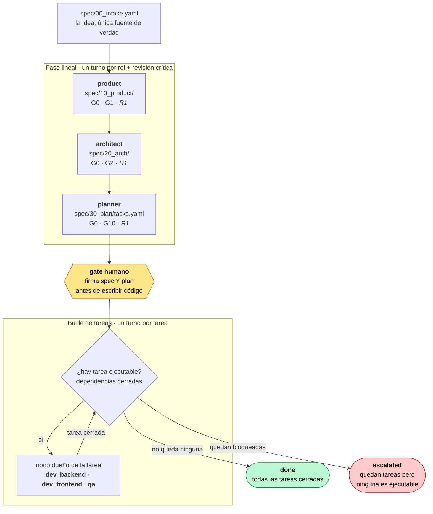
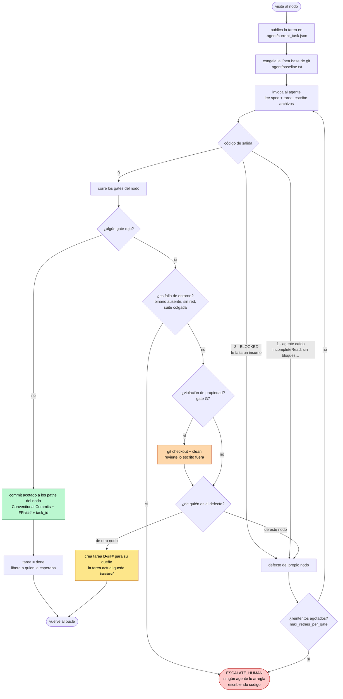
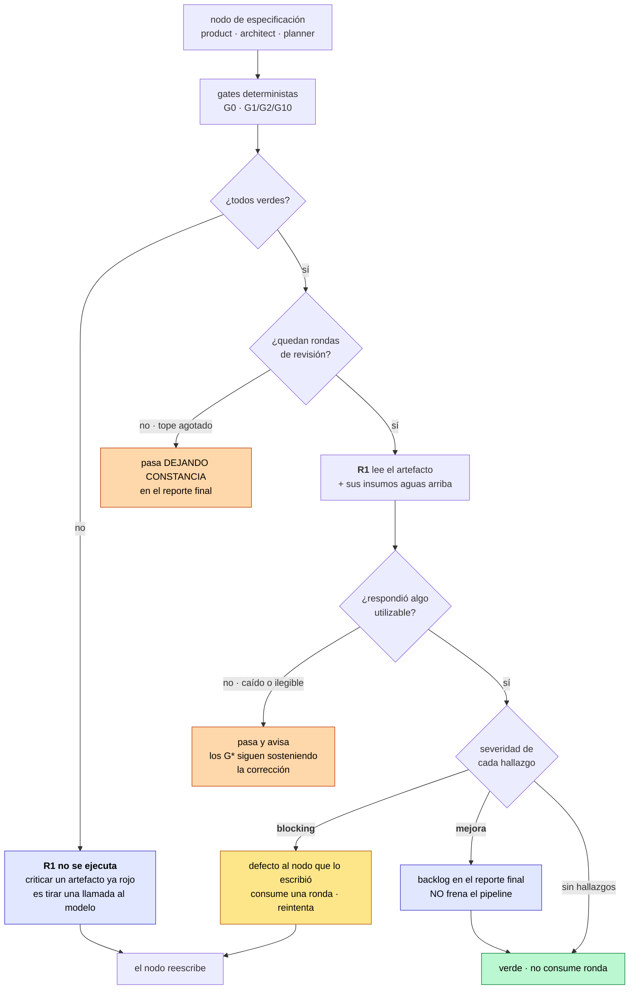
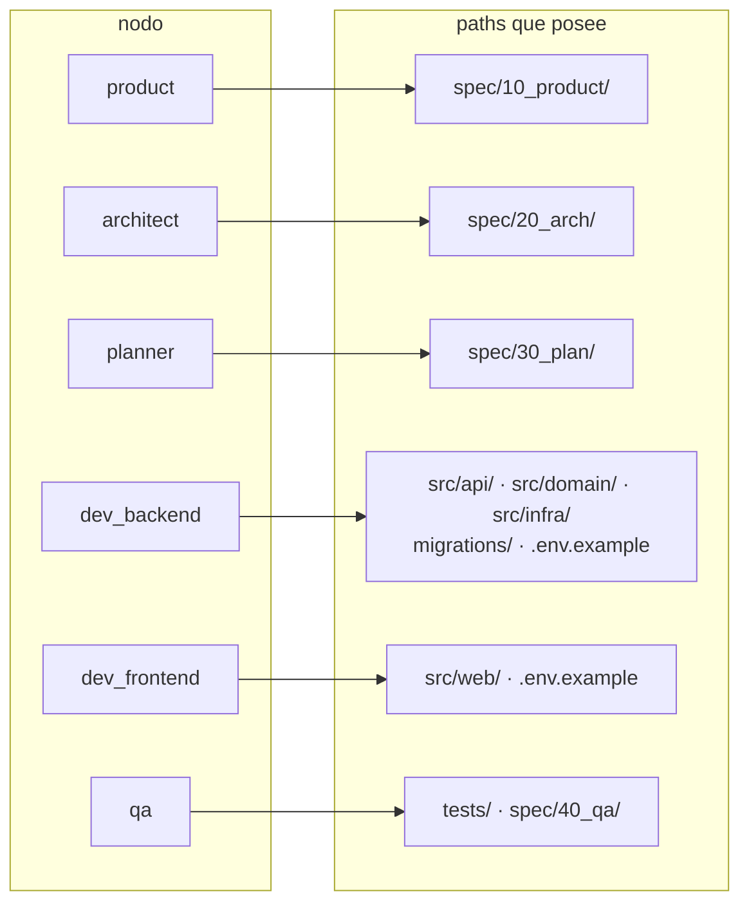
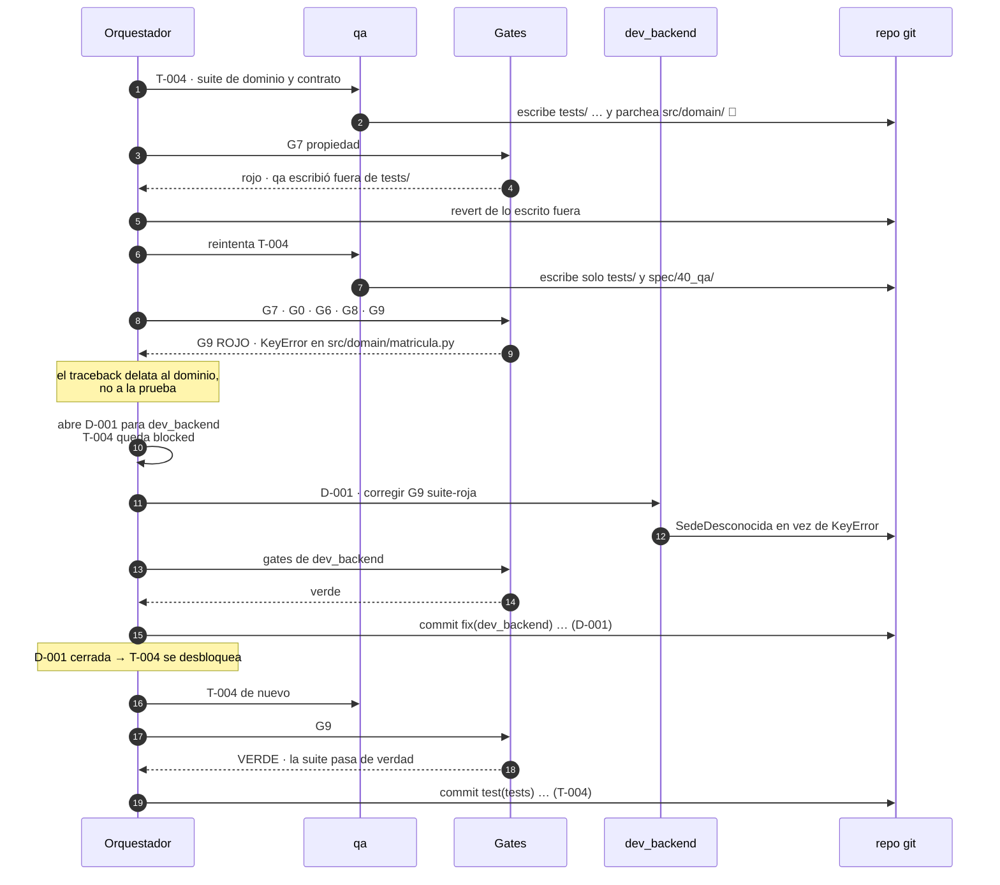
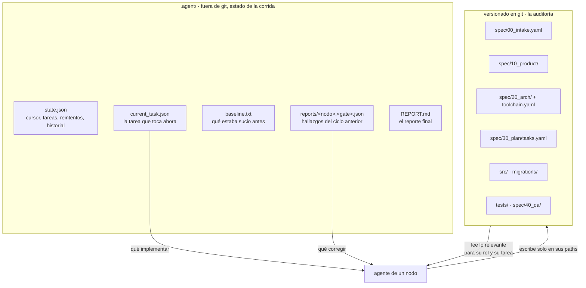
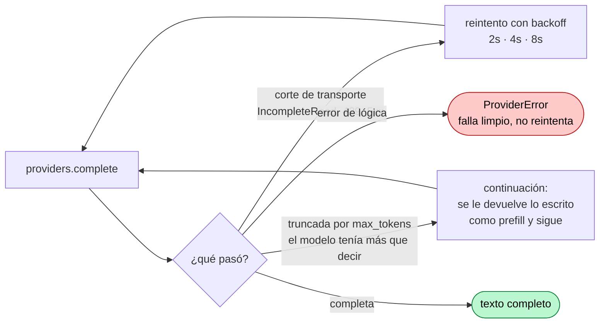

# Cómo funciona el pipeline hoy

Documento de referencia del comportamiento **actual** del sistema (no del deseado).
Todo lo que aparece aquí está implementado y cubierto por `python -m sdd test`.

---

## 1. Vista general: dos fases

La fase lineal produce la especificación y el plan. El bucle de tareas ejecuta ese
plan. Entre ambas, una firma humana.

En modo `--autonomous` (el del panel web) el gate humano se auto-aprueba, pero solo
se alcanza tras `product`, `architect` y `planner` en verde: nunca firma sobre un
plan inválido.

---

## 2. El ciclo de un nodo: dónde se decide todo

Este es el corazón del sistema. Cada visita a un nodo pasa por aquí, tanto en la
fase lineal como dentro del bucle.

**Las tres decisiones que antes no existían** y que sostienen todo lo demás:

- un agente con `exit != 0` **no avanza** — es un defecto del nodo, no un éxito;
- un defecto ajeno **no es un reintento a ciegas** — se convierte en trabajo `D-###`
  asignado a su dueño;
- un fallo de entorno **escala de inmediato** en vez de quemar reintentos.

---

## 2 bis. R1: el revisor crítico

`R1` **no es un gate G\***. Los `G*` son código determinista sin juicio; R1 es un
modelo leyendo el trabajo de otro modelo. Verifica lo que la forma no alcanza:
un PRD puede pasar G1 entero y seguir siendo inservible.

Por eso está acotado por diseño — puede **añadir** defectos, nunca relajar un `G*`.

**Las cuatro cotas que impiden el pulido infinito:**

| Cota | Por qué |
|---|---|
| Corre el último, y solo si los `G*` están verdes | no se gastan tokens criticando algo que ya se va a reescribir |
| Solo `blocking` frena | un revisor siempre encuentra algo mejorable; si todo bloqueara, no converge |
| Tope de rondas por nodo (2 por defecto) | sobre un artefacto subjetivo como un PRD no hay punto fijo garantizado |
| Solo la ronda que **bloquea** consume presupuesto | una revisión limpia no debe castigar al nodo |

Si el revisor se cae o responde algo ilegible, el gate **pasa y lo registra**. Es
deliberado: los deterministas siguen sosteniendo la corrección, y tumbar la corrida
porque el crítico se cayó cuesta más de lo que protege. Lo que no hace es callárselo.

El revisor puede correr en otro modelo (`SDD_REVIEW_MODEL`): un crítico que es
literalmente el mismo modelo tiende a validar su propio criterio.

---

## 3. Quién puede escribir dónde, y quién lo verifica

La propiedad se declara en `pipeline.toml` y la verifica G7 a posteriori con
`git status`. Escribir fuera = revert automático.

### Gates por nodo

| Nodo | Gates | Qué exigen |
|---|---|---|
| `product` | **G0** · G1 · *R1* | entregables presentes · todo FR con escenario Gherkin · *criterio: alcance, requisitos falsables, casos negativos* |
| `architect` | **G0** · G2 · *R1* | entregables presentes · NFR medibles, ADR con alternativas y coste, `toolchain.yaml` · *criterio: sobrearquitectura, umbrales alcanzables* |
| `planner` | **G0** · G10 · *R1* | entregables presentes · plan sin ciclos, todo FR con tarea, entregables dentro de propiedad · *criterio: tamaño de tarea, dependencias reales* |
| `dev_backend` | G7 · **G0** · G4 · G5 · **G6** | propiedad · entregables · tamaño · sin secretos ni valores de entorno · imports resueltos |
| `dev_frontend` | G7 · **G0** · G4 · G5 · **G6** | idem |
| `qa` | G7 · **G0** · **G6** · G8 · **G9** | propiedad · entregables · imports · cobertura de `@critical` · **la suite se ejecuta y pasa** |

En negrita, los gates nuevos; en cursiva, la revisión. **G9 es el único que
ejecuta**: corre `install`/`typecheck`/`test` según `spec/20_arch/toolchain.yaml`.
Mientras ningún gate ejecute, el verde del pipeline no significa nada.

Dos categorías, y la distinción importa: `G*` es código determinista y su veredicto
es incuestionable; `R1` es juicio, y por eso está acotado y solo puede añadir.

---

## 4. Caso real: cómo se comporta ante un defecto ajeno

Esto es exactamente lo que hace `python -m sdd demo` (0 tokens). QA descubre un bug
de dominio que ningún linter puede ver, y el sistema lo lleva a su dueño.

Esa es la diferencia entre una cadena de montaje y un equipo: el defecto **cambia de
dueño** en vez de rebotar contra quien lo encontró.

---

## 5. Repo-as-state: qué se pasa entre nodos

Los agentes no se pasan contexto por chat. Todo lo que necesitan lo leen del repo.

`state.json` es lo que permite reanudar: `--from task_loop` continúa un sprint a
medias sin repetir lo ya cerrado.

---

## 6. Resiliencia de la llamada al modelo

Dos fallos distintos, dos defensas distintas. Antes había un único turno sin red de
seguridad, y un corte de transporte mataba el nodo entero.

Si sigue truncando tras 6 continuaciones, el error lo dice claro: *la tarea es
demasiado grande, divide el plan*. Eso apunta al planner, que es donde está el
problema de verdad.

---

## Límites de este flujo

- **Secuencial.** El plan ya declara dependencias, así que las tareas sin relación
  podrían correr en paralelo; el bucle todavía las ejecuta de una en una.
- **R2 revisa el código por tarea** (`dev_backend`, `dev_frontend`, `qa`), con el
  mismo mecanismo que R1 y estado por tarea. Su criterio real no está medido: en
  `--simulate` no bloquea, y el modo real no se ha ejecutado.
- **R1/R2 cuestan una llamada al modelo por nodo/tarea y ronda.** El
  `skip_if_prior_failed` evita las inútiles, pero el coste no es cero: en un plan
  grande, R2 añade una llamada por tarea de código.
- **Sin aprendizaje entre corridas.** Un defecto que se repite siempre debería
  acabar en el prompt del nodo, y hoy no lo hace.
- **El presupuesto cuenta llamadas, no tokens ni USD.**
- **El modo real no se ha ejecutado contra un modelo.** Todo lo de arriba está
  verificado en simulación y con 78 pruebas.
