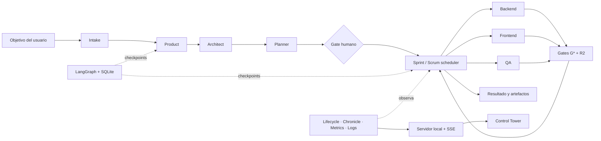

# AutoScrum · SDD Multi-Agent Control Tower

AutoScrum es una aplicación local que convierte un objetivo de producto en una ejecución de ingeniería trazable. Combina un pipeline SDD multiagente sobre LangGraph, gates deterministas, aislamiento Git por tarea, persistencia local y un panel web de observabilidad en tiempo real.

La aplicación se distribuye como un único paquete Python y puede operarse desde la CLI o desde el **Control Tower** web.

> Versión del paquete: `0.3.1` · Python `>= 3.11`

## Estado actual

| Área | Estado |
|---|---|
| Pipeline `product → architect → planner → human_gate` | Operativo |
| Sprint paralelo `dev_backend`, `dev_frontend` y `qa` | Operativo |
| Checkpoints LangGraph en SQLite y reanudación | Operativo |
| Gates deterministas `G*` y revisión crítica `R1/R2` | Operativo |
| Worktrees Git por tarea e integración determinista | Operativo |
| Control Tower con actualización SSE | Operativo |
| Historial, artefactos, logs y trazas por tarea | Operativo |
| Configuración de proveedor y perfiles por agente | Operativo |
| Routing adaptativo, discovery y escalado por tarea | Operativo |
| Agentes personalizados | Catálogo y persistencia; incorporación automática al grafo pendiente |
| Vista de memoria | Preparada; el runtime aún no emite eventos de memoria |
| Ejecución horizontal multiproceso | No soportada; la persistencia actual es local |

## Capacidades principales

- **Objetivos ricos:** la nueva ejecución usa un compositor de pantalla completa con títulos, negrita, cursiva, listas, enlaces y contador. El contenido se normaliza a texto compatible con Markdown antes del run.
- **Historia por iteración:** objetivo, orquestación, subtareas, gates, bloqueos, resultado y artefactos forman un hilo navegable.
- **Observabilidad multiagente:** una matriz animada muestra agentes en espera, pensando, ejecutando, transmitiendo, completados o en error.
- **Click-to-inspect:** cada agente o tarea abre un drawer con resumen, lifecycle, logs filtrables, I/O y memoria.
- **Tiempo real:** el navegador recibe snapshots mediante Server-Sent Events (`/events`) y usa polling como fallback.
- **Configuración modular:** `Configuración → Agentes` permite activar agentes, elegir proveedor/modelo, ajustar temperatura y tokens, editar instrucciones y seleccionar herramientas.
- **Persistencia auditable:** checkpoints, estado, métricas, tokens, lifecycle, chronicle y logs viven dentro de cada ejecución.
- **Fail-fast:** credenciales ausentes, agentes deshabilitados, timeouts o conflictos de lease producen un estado explícito.

## Arquitectura



### Fase de especificación

1. `product` produce el PRD y escenarios funcionales.
2. `architect` define NFR, API, entorno, amenazas y toolchain.
3. `planner` crea `spec/30_plan/tasks.yaml`.
4. `human_gate` interrumpe el grafo hasta recibir aprobación.

### Sprint de tareas

El scheduler selecciona tareas con dependencias cerradas y entregables sin solapamiento. Ejecuta hasta `runtime.max_concurrency` tareas simultáneas, cada una en su Git worktree. Scrum prioriza defectos, camino crítico y trabajo que desbloquea otras tareas; el colector integra los deltas en orden determinista.

Un defecto perteneciente a otro nodo se convierte en una tarea `D-###`; la tarea que lo detectó permanece bloqueada hasta que el dueño lo cierre.

### Reglas de integridad

- Un agente con código de salida distinto de cero no avanza.
- `G0` exige los entregables declarados.
- `G7` revierte cambios fuera de la propiedad de paths.
- `G9` ejecuta el toolchain real del proyecto.
- Los gates `G*` son deterministas; `R1/R2` solo añaden hallazgos.
- Cada tarea tiene presupuesto, timeout, lifecycle y commit propios.
- Un lease por ejecución evita competencia por SQLite o Git.

## Control Tower web

```powershell
sdd web
```

Abre `http://127.0.0.1:8770`. Para no abrir el navegador o cambiar el puerto:

```powershell
sdd web --no-open --port 8770
```

### Navegación

- **Vista en vivo:** iteraciones, historia, topología de agentes, subtareas, gates y resultados.
- **Historial:** proyectos y ejecuciones persistidas.
- **Resultados:** artefactos generados y visor de contenido.
- **Configuración:** tabs de General, Proveedores, Agentes, Runtime y Seguridad.

### Nueva ejecución

El modal ocupa el viewport y prioriza el campo **Objetivo del workflow**. El editor admite títulos, énfasis, listas y enlaces. También solicita proyecto, nombre de ejecución, proveedor, modelo y API key, y muestra la ruta de salida.

### Estados de agentes

| Estado | Significado |
|---|---|
| `idle` | disponible |
| `queued` | esperando dependencias o cupo |
| `thinking` | procesando contexto o respuesta |
| `tool` | ejecutando herramienta, gate o API |
| `streaming` | recibiendo o transmitiendo salida |
| `completed` | trabajo cerrado |
| `error` | fallo, gate rojo, bloqueo o escalamiento |
| `disabled` | excluido por configuración |

La interfaz respeta `prefers-reduced-motion`.

### Inspector de agente

- **Resumen:** estado, rol, modelo, tarea activa, progreso y herramientas.
- **Traza:** eventos append-only, gates, bloqueos, reintentos, llamadas y tokens.
- **Logs:** auto-scroll, búsqueda, filtro por nivel y copia.
- **I/O:** prompt base e instrucciones del operador.
- **Memoria:** reservado para futuros eventos `memory.read` y `memory.write`.

## Instalación

Requiere Python 3.11+, Git, las herramientas del proyecto que ejecutará `G9` y una API key para el modo real.

```powershell
git clone <url-del-repositorio>
cd auto_scrum
python -m venv .venv
.\.venv\Scripts\Activate.ps1
python -m pip install -e .
```

En Linux/macOS: `source .venv/bin/activate`. También se puede usar `python -m sdd <comando>` sin instalar el script global.

## Inicio rápido

### Demo sin tokens

```powershell
sdd demo
```

La demo crea un repositorio, ejecuta agentes simulados y ejercita propiedad de paths, gates, defectos y pruebas reales sin llamar a un LLM.

### Ejecución real desde la UI

```powershell
sdd web
```

Configura proveedor y credencial, abre **Nueva ejecución**, redacta el objetivo y observa el workflow.

### Ejecución real desde la CLI

```powershell
$env:ANTHROPIC_API_KEY = "sk-ant-..."
sdd doctor
sdd run --project mi-app --task primera-ejecucion
```

Con un intake existente:

```powershell
sdd run --project mi-app --task api-v1 --intake .\mi-idea.yaml
```

Para reanudar:

```powershell
sdd resume --workdir .\project\mi-app\primera-ejecucion
```

`--autonomous` continúa sin intervención humana y `--node` reanuda un nodo concreto.

## Comandos

| Comando | Propósito |
|---|---|
| `sdd menu` | Menú interactivo |
| `sdd shell` | Consola interactiva |
| `sdd demo` | Pipeline simulado |
| `sdd run` | Inicia una ejecución real |
| `sdd resume` | Continúa desde un checkpoint |
| `sdd web` / `sdd serve` | Inicia el Control Tower |
| `sdd doctor` | Verifica proveedor, modelo y credencial |
| `sdd config` | Muestra configuración con keys enmascaradas |
| `sdd show` | Resumen en terminal |
| `sdd view` | Genera reporte HTML |
| `sdd tasks` | Consulta tareas y lifecycle |
| `sdd chronicle` | Consulta visitas de agentes |
| `sdd gates` | Ejecuta gates de un nodo |
| `sdd clean` | Limpia una ejecución objetivo |
| `sdd test` | Ejecuta la suite |

Usa `sdd <comando> --help` para ver opciones.

## Proveedores

| `SDD_PROVIDER` | Credencial | Integración |
|---|---|---|
| `anthropic` | `ANTHROPIC_API_KEY` | SDK oficial |
| `deepseek` | `DEEPSEEK_API_KEY` | compatible con OpenAI |
| `qwen` | `DASHSCOPE_API_KEY` | DashScope compatible |
| `glm` | `ZHIPUAI_API_KEY` | Zhipu compatible |
| `kimi` | `MOONSHOT_API_KEY` | Moonshot compatible |
| `openai` | `SDD_API_KEY` | endpoint definido en `SDD_BASE_URL` |

Variables relevantes:

```text
SDD_PROVIDER
SDD_MODEL
SDD_BASE_URL
SDD_API_KEY
SDD_TEMPERATURE
SDD_MAX_TOKENS
SDD_REVIEW_MODEL
SDD_PROMPT_CACHE
```

`SDD_MODEL` reemplaza el modelo por defecto. Un endpoint OpenAI-compatible genérico requiere `SDD_BASE_URL`, `SDD_API_KEY` y `SDD_MODEL`. Los perfiles de la UI pueden reemplazar proveedor, modelo, temperatura y máximo de tokens por agente.

## Enrutamiento adaptativo de modelos

`Configuración → Agentes` incluye una política central con vista previa para los seis roles y R1/R2. En modo `adaptive`, `product`, `architect` y `planner` solicitan `frontier`; backend y frontend empiezan en `economy`; QA empieza en `balanced`. Las tareas de implementación y QA pueden consumir un único escalado `frontier` al fallar uno de sus gates propios o R2. El contador vive en el estado de la tarea, por lo que una reanudación no reinicia el escalado.

La selección respeta, en orden, el override explícito del perfil, el proveedor global y la prioridad configurada. Los modelos sin credencial o sin tier clasificado no entran al routing automático. Si falta el tier solicitado se usa el mejor candidato configurado y se registra `fallback_reason`; si no hay ninguna credencial válida, la invocación falla inmediatamente.

R1/R2 tienen un perfil independiente y prefieren un proveedor `frontier` distinto al autor. `SDD_REVIEW_MODEL` continúa siendo compatible y puede combinarse con `SDD_REVIEW_PROVIDER`. El fallo del revisor conserva el comportamiento fail-open documentado; los gates deterministas mantienen autoridad.

El catálogo se actualiza con `POST /models/discover`. El último catálogo válido permanece en `config.json`. Un modelo nuevo recibe su tier con la misma función que usa el runtime (`classify_model`), de modo que el catálogo y la ejecución nunca afirman tiers distintos sobre el mismo modelo; un tier fijado a mano en `config.json` siempre gana. `GET /routing/preview` expone decisiones y candidatos deshabilitados, nunca API keys.
## Configuración de agentes

| ID | Rol | Tipo |
|---|---|---|
| `product` | Product Strategist | Especificación |
| `architect` | Solution Architect | Especificación |
| `planner` | Delivery Planner | Especificación |
| `dev_backend` | Backend Engineer | Tarea |
| `dev_frontend` | Frontend Engineer | Tarea |
| `qa` | Quality Engineer | Tarea |

Cada perfil persiste `enabled`, proveedor, modelo, temperatura `0.0–2.0`, `max_tokens`, herramientas, el `system_prompt` efectivo y `prompt_addon`. El runtime usa el override si existe y, en caso contrario, el prompt nativo de `sdd/agents/`.

La pestaña permite importar y exportar un bundle JSON portable de agentes. El bundle incluye prompts y parámetros, pero excluye API keys y configuración global del proveedor. Los agentes personalizados aparecen en el catálogo y pueden editarse. El grafo automático sigue definido por `sdd/pipeline.toml`; para que un agente nuevo participe todavía debe integrarse en ese contrato.

## Dónde se guardan los datos

La ruta base es `project/`. La UI crea una carpeta por proyecto y ejecución:

```text
project/
└── <proyecto>/
    └── <ejecucion>/
        ├── spec/
        │   ├── 00_intake.yaml
        │   ├── 10_product/
        │   ├── 20_arch/
        │   ├── 30_plan/
        │   └── 40_qa/
        ├── src/
        ├── tests/
        ├── REPORT.md
        └── .agent/
            ├── state.json
            ├── checkpoints.sqlite
            ├── run.log
            ├── metrics.jsonl
            ├── usage.jsonl
            ├── tasks/<task-id>/lifecycle.jsonl
            └── chronicle/<visit-id>/
```

La ruta puede cambiarse en `Configuración → General` o con `output_base` en `config.json`.

`config.json` guarda tema, ruta base, proveedor, modelo, keys, perfiles, agentes personalizados y la política/catálogo de routing. `config.json`, `project/` y `.agent/` están en `.gitignore`.

> **Seguridad:** una key guardada en `config.json` queda en texto claro. Define la variable de entorno del proveedor (`ANTHROPIC_API_KEY`, `DEEPSEEK_API_KEY`, …) y el sistema deja de escribirla a disco: `config.save()` no duplica el secreto cuando la variable ya existe. `sdd doctor` avisa de las keys que sigan en claro y de qué variable las sustituye. Si una key estuvo expuesta en un log, una captura o un transcript, rótala.

## Observabilidad

| Archivo | Contenido |
|---|---|
| `.agent/state.json` | Proyección legible del estado global |
| `.agent/checkpoints.sqlite` | Checkpoints de LangGraph |
| `.agent/run.log` | Salida de ejecución |
| `.agent/metrics.jsonl` | Latencias de proveedor, nodos, gates, Git y checkpoints |
| `.agent/usage.jsonl` | Llamadas y tokens |
| `.agent/tasks/*/lifecycle.jsonl` | Eventos por tarea |
| `.agent/chronicle/*` | Prompt, contexto, respuesta y metadatos por visita |

```powershell
sdd tasks --workdir .\project\mi-app\api-v1 --verbose
sdd tasks --workdir .\project\mi-app\api-v1 --task-id T-003
sdd chronicle --workdir .\project\mi-app\api-v1 --recent 10
sdd chronicle --workdir .\project\mi-app\api-v1 --visit-id <id> --full
```

`--full` puede mostrar prompts y respuestas sensibles.

## Gates

| Gate | Responsabilidad |
|---|---|
| `G0` | Entregables presentes y no vacíos |
| `G1` / `G8` | Trazabilidad |
| `G2` | Contrato de arquitectura |
| `G4` | Tamaño y estructura |
| `G5` | Hardcoding y entorno |
| `G6` | Imports y coherencia estática |
| `G7` | Propiedad de paths e integridad Git |
| `G9` | Toolchain real: install/lint/typecheck/security/test/coverage |
| `G10` | Contrato del plan y DAG |
| `R1` | Revisión crítica de especificación |
| `R2` | Revisión de implementación por tarea |

Un checker determinista imprime `{"findings":[{"file","line","rule","evidence"}]}` y sale con código `1` cuando hay hallazgos.

## Runtime

`sdd/pipeline.toml` define nodos, prompts, propiedad de paths, entregables, gates, comandos, concurrencia, timeouts y presupuestos.

```toml
max_concurrency = 6
gate_concurrency = 4
```

Reducir `max_concurrency` a `1` conserva la semántica y elimina el paralelismo efectivo.

## API local

| Método | Ruta | Uso |
|---|---|---|
| `GET` | `/state` | Snapshot activo |
| `GET` | `/events` | Stream SSE |
| `GET` | `/projects`, `/tasks`, `/task` | Historial |
| `GET` | `/lifecycle` | Traza de tarea |
| `GET` | `/chronicle` | Visitas de agentes |
| `GET` | `/artifact` | Lectura segura de artefactos |
| `GET/POST` | `/config` | Configuración y catálogo; las respuestas nunca incluyen API keys |
| `GET` | `/routing/preview` | Decisiones proyectadas y candidatos sin secretos |
| `POST` | `/models/discover` | Actualiza el catálogo del proveedor |
| `GET` | `/agent-bundle` | Exportación portable de prompts y perfiles, sin secretos |
| `POST` | `/run` | Nueva ejecución |
| `POST` | `/resume` | Reanudación |

No expongas este servidor directamente a Internet: no incluye autenticación, TLS ni aislamiento multiusuario.

## Estructura del repositorio

```text
pyproject.toml
README.md
sdd/
├── __main__.py             # entrada
├── cli.py                  # comandos
├── server.py               # API, SSE y servidor web
├── webpage.py              # HTML del Control Tower
├── web_script.py           # carga static/app.js
├── web_styles.py           # carga static/app.css
├── static/app.js           # interacción y renderizado (JS real, no literal Python)
├── static/app.css          # sistema visual
├── graph_runtime.py        # LangGraph y SQLite
├── orchestrator.py         # supervisor
├── parallel_tasks.py       # scheduler y workers
├── scrum.py                # prioridad
├── taskqueue.py            # dependencias y defectos
├── task_worktrees.py       # aislamiento Git
├── lifecycle.py            # eventos por tarea
├── chronicle.py            # visitas de agentes
├── metrics.py              # métricas y tokens
├── config.py               # configuración
├── providers.py            # proveedores LLM
├── model_router.py          # política, catálogo, discovery y selección
├── agent.py                # ejecución del agente
├── report.py               # reportes
├── pipeline.toml           # contrato del workflow
├── agents/                 # prompts base
├── gates/                  # checkers
└── examples/fake_agent.py  # simulador
tests/
```

## Desarrollo y pruebas

```powershell
python -m pip install -e .
sdd test
```

Pruebas específicas:

```powershell
python -m pytest tests\test_control_tower_ui.py -q
python -m pytest tests\test_ui.py -q
python -m pytest tests\test_task_loop.py tests\test_langgraph_runtime.py -q
```

El proyecto usa `codebase-memory-mcp` y está indexado bajo el nombre `D-Miguel-auto_scrum`. Para entender el sistema conviene empezar por `manage_adr(mode="get")`, que devuelve la arquitectura persistida. Para descubrir código se consulta primero el grafo (`search_graph`, `trace_path`, `get_code_snippet`) y se usa búsqueda textual solo para literales, configuración o cuando el índice sea insuficiente. El protocolo completo, con la tabla de qué herramienta usar en cada caso y las reglas para mantener el índice limpio, está en `CLAUDE.md`.

## Límites conocidos

- SQLite y el lease están diseñados para una aplicación local de un proceso; un despliegue multiproceso necesita persistencia compartida.
- La idempotencia completa depende del soporte del proveedor externo.
- El consumo está instrumentado en tokens, no en moneda.
- Los agentes personalizados aún no se insertan automáticamente en el grafo.
- La pestaña de memoria espera eventos estructurados del runtime.
- Calidad y coste con modelos reales deben medirse por proveedor y proyecto.
