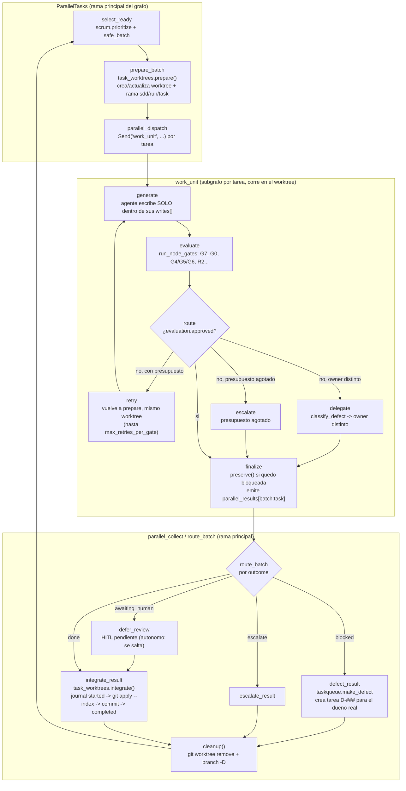

# Arquitectura interna

Este documento profundiza donde el [README](../README.md) se queda en la
vista de alto nivel (diagramas de flujo del pipeline, tabla de "quién dirige
la orquesta"). Aquí está el grafo real que ejecuta LangGraph, la forma exacta
del estado, el mecanismo de checkpoint/resume, cómo decide el scheduler
paralelo, el ciclo de vida de un worktree por tarea y el lease de exclusión
entre procesos. No repite lo que el README ya cubre: instalación, comandos,
gates uno por uno o el modelo de propiedad de paths — para eso están el
README y `CLAUDE.md`.

Audiencia: alguien que va a modificar `sdd/runtime/`.

## 1. El grafo real

El README muestra el pipeline como una cadena `product → architect → planner
→ human_gate → sprint`. Esa es la lectura de negocio. El `StateGraph` que
`sdd/runtime/graph_runtime.py` compila tiene muchos más nodos que eso — casi
30 — porque cada transición de evaluación, revisión humana y ruteo de defecto
es un nodo explícito, no una rama de `if` dentro de un nodo grande. Esto es
deliberado: LangGraph, no Python, gobierna las rondas de reintento y el punto
de interrupción, así que cada decisión necesita ser una arista.

`pipeline.toml` no se traduce 1:1 a nodos de LangGraph. Define **contrato**
(quién escribe qué, qué gates corre, cuál es el siguiente nodo declarado) que
`sdd/runtime/orchestrator.py` lee a `nodes: dict[str, dict]` y pasa como
argumento a casi todos los constructores de nodos; el grafo en sí lo
construye `run_pipeline()` a partir de dos fuentes: los `node.id` de
`pipeline.toml` (para saber cuáles son agentes, ver
`sdd/runtime/graph_runtime.py:80-83`) y un conjunto fijo de nodos de control
que no existen en el TOML (`bootstrap`, `evaluate`, `human_review`,
`classify_decision`, todo el sub-flujo de `parallel_*`, etc.).

### 1.1 Nodos de la fase lineal y de unidad

| Nodo LangGraph | Rol | Fuente |
|---|---|---|
| `bootstrap` | Chequea presupuesto de pared/tokens antes de cada visita; decide si el grafo sigue o termina | `graph_runtime.py:62-78` |
| `prepare` | Asigna `active_visit` (id determinista de la visita) | `graph_runtime.py:91-94` |
| `product`, `architect`, `planner`, `dev_backend`, `dev_frontend`, `qa` | Un nodo por cada `[[node]]` de `pipeline.toml` cuyo `type` no es `human`; todos comparten la misma función `agent_node` | `graph_runtime.py:80-83, 99-106, 351-353` |
| `evaluate` | Corre gates/revisor sobre lo que generó el agente activo | `graph_runtime.py:111-123` |
| `human_review` | Punto de interrupción; en modo autónomo genera una decisión `accept` sintética en vez de interrumpir | `graph_runtime.py:145-177` |
| `classify_decision` → `retry_unit` / `delegate_unit` / `escalate_unit` | Aplica `classify_defect` y una de las tres funciones de `workflow_defects` | `graph_runtime.py:202-224` |
| `validate_unit_content` | Revalida que los artefactos no cambiaron entre evaluación y aprobación (usa `content_hash`) | `graph_runtime.py:226-247` |
| `approve_unit` → `continue_approved` / `complete_approved` | Efecto de aprobación (commit) y ruteo al siguiente nodo del contrato o a `done` | `graph_runtime.py:249-278` |
| `human_gate`, `accept_legacy`, `reject_legacy` | Nodo de **compatibilidad**: migra checkpoints viejos que quedaron parados en el antiguo gate exclusivo del plan | `graph_runtime.py:312-346` |

### 1.2 Nodos del sprint paralelo

| Nodo | Rol | Fuente |
|---|---|---|
| `task_loop` → `load_reconcile` → `select_ready` → `prepare_batch` | Recarga el plan, reconcilia defectos ya cerrados, elige el lote de tareas sin conflicto de paths y crea sus worktrees | `parallel_tasks.py:52-151` |
| `parallel_dispatch` | Nodo sin cuerpo; su única función es la arista condicional `parallel.dispatch`, que emite un `Send("work_unit", …)` por tarea del lote | `graph_runtime.py:400, 429`; `parallel_tasks.py:157-171` |
| `work_unit` | Subgrafo completo compilado por `WorkUnitGraph` (ver 1.3) — una instancia por rama `Send` | `graph_runtime.py:132-134, 401` |
| `parallel_collect` → `route_batch` → `defer_review` / `integrate_result` / `delegate_result` / `defect_result` / `escalate_result` → `finish_batch` | Colector: por cada resultado de rama decide si aprueba, integra, delega, convierte en defecto o escala; recicla al colector hasta vaciar la cola | `parallel_tasks.py:173-251` |

### 1.3 El subgrafo por tarea (`WorkUnitGraph`)

Cada rama `Send` no ejecuta una función aislada: ejecuta su propio
`StateGraph(PipelineState, output_schema=WorkUnitOutput)` (`work_unit_graph.py:259`),
con nodos `prepare → budget_check → generate → evaluate → route → {retry|delegate|escalate} → finalize`.
`retry` vuelve a `prepare` dentro del mismo subgrafo (`work_unit_graph.py:284`) —
el reintento de una tarea paralela no vuelve a pasar por el scheduler
principal; vive dentro de la rama hasta que se agota `max_retries_per_gate`.
Esto es lo que permite que `max_concurrency` tareas reintenten de forma
independiente sin que una tarea lenta bloquee el fan-in de las demás.

`finalize` (`work_unit_graph.py:208-256`) es el único punto donde una rama
paralela le entrega algo al grafo principal: escribe
`{"parallel_results": {f"{batch_id}:{task_id}": result}}`, que el reducer
`merge_results` (`workflow_state.py:8-14`) acumula sin pisar los resultados de
las otras ramas del mismo superstep — es el mecanismo de fan-in de LangGraph
aplicado a `Send`.

## 2. Forma del estado — `PipelineState`

`PipelineState` (`sdd/runtime/workflow_state.py:17-66`) es un `TypedDict`
único compartido por el grafo principal y por cada subgrafo `work_unit`. No
hay un estado "resumido" separado del estado "detallado": todo lo que un nodo
necesita leer o escribir vive en esta misma estructura, y **es exactamente lo
que `AsyncSqliteSaver` persiste** — LangGraph checkpointea el diccionario de
canales completo después de cada superstep, no un subconjunto curado. En ese
sentido no hay campos "transitorios" dentro de `PipelineState` en el sentido
de "nunca llega a disco"; la distinción real es otra (ver §3).

Grupos de campos relevantes:

- **Identidad y control de ejecución**: `run_id` (usado como `thread_id` del
  checkpointer, `graph_runtime.py:447`), `cursor`, `status`
  (`running|done|escalated|waiting_human`), `agent_calls`, `started_at`.
- **Presupuesto anti-oscilación**: `attempts` y `gate_refunds` —
  `gate_refunds` existe específicamente porque devolver el presupuesto
  completo cada vez que un gate pasa abría una vía de escape al tope de
  reintentos (ver el docstring largo de `refund_attempts` en
  `orchestrator.py:183-216`); solo se cuenta un reembolso cuando la unidad
  ya estaba al borde de escalar.
- **Cola de tareas**: `tasks` (lista de dicts con `status`, `depends_on`,
  `blocked_by`, `workspace`), `current_task`, `defect_seq` (contador de
  `D-###`).
- **Unidad de trabajo activa**: `generation`, `evaluation`, `decomposition`,
  `pending_review`, `defect_decision`, `human_decision`, `feedback`,
  `retry_count`, `content_validation`. Estos campos representan una única
  ronda generate→evaluate→(human_review)→apply_decision; se limpian a `None`
  en cada transición de aprobación/rechazo.
- **Lote paralelo**: `batch_seq`, `parallel_batch` (`{id, task_ids,
  agent_quota}`), `parallel_results` (reducer `merge_results`,
  `Annotated[dict, merge_results]` en `workflow_state.py:57`),
  `worker_task_id`, `work_unit_started`, `work_unit_error`,
  `ready_task_ids`, `collect_queue`, `review_result_keys`, `schedule_route`.
- **Auditoría de resume**: `resume_history`, `resume_checkpoint`,
  `resume_recovery`, `original_started_at`, `resume_started_at`,
  `resume_stack`, `resume_at`, `recoveries`, `recovery_seq`. Construidos por
  `sdd/runtime/run_state.py:118-158` (`prepare_resume`), no por
  `graph_runtime.py`.
- **Historial legible**: `history` (lista append-only de eventos de log),
  `iterations` (una entrada por etapa `generation`/`evaluation`/
  `human_review` de cada unidad, con `feedback` y `findings` — es lo que
  permite reconstruir por qué una unidad fue rechazada sin ir a los logs).

`WorkUnitOutput` (`workflow_state.py:69-72`) es el *output schema* del
subgrafo `work_unit`: declara que lo único que una rama expone al padre es
`parallel_results`, aunque internamente maneje una copia completa de
`PipelineState`. Esto es lo que impide que una rama paralela pise por
accidente campos como `tasks` o `history` del estado principal — LangGraph
solo aplica el reducer sobre las claves declaradas en el output schema.

### 2.1 Normalización y deltas

`sdd/runtime/graph_state.py` es deliberadamente pequeño: no define el
estado, lo sanea.

- `normalize()` (`graph_state.py:23-40`) rellena valores por defecto para
  cualquier campo ausente — necesario porque un checkpoint viejo (de antes
  de que se añadiera un campo) no lo tendrá, y cada nodo asume que existe.
  También fija `engine="langgraph"` y `checkpoint_db=".agent/checkpoints.sqlite"`,
  que son metadatos de proyección, no de control.
- `delta()` (`graph_state.py:12-20`) es lo que cada función de nodo devuelve
  en vez del estado completo: solo las claves que cambiaron respecto al
  `before`. Esto es el "guarda deltas compactos" que menciona `HANDOFF.md` —
  pero el ahorro es de trabajo por nodo (comparar y serializar menos), no un
  esquema de almacenamiento distinto en SQLite; LangGraph sigue aplicando
  esos deltas sobre los canales y AsyncSqliteSaver checkpointea el resultado
  fusionado completo.
- Caso especial: si `parallel_results` se vació (`not value and
  before.get(key)`), `delta()` no devuelve `{}` — devuelve
  `{RESET_RESULTS: True}`, que el reducer `merge_results` interpreta como
  "descarta todo lo acumulado" (`workflow_state.py:11-13`). Sin este
  sentinel, un lote nuevo heredaría los resultados del lote anterior porque
  un diccionario vacío no sobrescribe nada bajo un reducer de acumulación.
- `visit_id()` (`graph_state.py:43-48`) deriva un id determinista de
  `run_id:cursor:current_task:agent_calls`; es lo que correlaciona logs,
  `chronicle` y métricas de una misma llamada al agente.

## 3. Checkpointing y resume

`AsyncSqliteSaver` (import en `graph_runtime.py:16`) es la única fuente de
verdad durable del grafo; vive en `.agent/checkpoints.sqlite`
(`CHECKPOINT_PATH`, `graph_runtime.py:36`). `.agent/state.json` **no es**
donde vive el estado — es una proyección legible que `project()`
(`graph_runtime.py:59-60`) escribe solo en dos puntos: cuando el grafo queda
esperando a un humano (`waiting`) y cuando termina (`final`)
(`graph_runtime.py:483-489`). Un lector externo (panel web, `sdd show`,
`sdd tasks`) lee `state.json` porque es JSON plano; el propio runtime nunca
reconstruye su ejecución desde ahí.

El `thread_id` del checkpointer es `str(initial["run_id"])`
(`graph_runtime.py:447`). `run_id` se genera una sola vez, en
`sdd/runtime/run_state.py:load_state()` (línea 15-29), y se conserva en
`state.json` entre invocaciones del proceso — por eso una segunda invocación
de `sdd resume` sobre el mismo `--workdir` encuentra el mismo hilo de
checkpoint que dejó la invocación anterior, aunque sean procesos de Python
distintos.

### 3.1 Qué hace `resume_requested`

`run_pipeline()` recibe `resume_requested: bool` (viene de `args.resume`, es
decir, del flag `--resume` de la CLI). Dentro de `execute_graph()`
(`graph_runtime.py:443-492`) hay tres caminos distintos según el estado del
checkpoint:

1. **Hay un `interrupt()` pendiente** (`_has_interrupt(before)`): se
   reanuda con `Command(resume=_decision_payload(initial))`
   (`graph_runtime.py:473-474`) — el único dato que cruza la frontera del
   `interrupt` es la decisión humana (`accept`/`reject` + actor + feedback),
   nunca la proyección completa del estado. Esto es literal en el comentario
   del código: *"El resume tecnico se reconstruye sobre SQLite, no sobre
   state.json"* (`graph_runtime.py:455-456`).
2. **`--resume` sin interrupt pendiente** (una corrida `running` que quedó
   huérfana porque el proceso murió, o una que escaló): se llama
   `prepare_resume()` (`sdd/runtime/run_state.py:118-158`) sobre el snapshot
   autoritativo tomado del propio checkpoint (`before.values`, no de
   `state.json`), lo que da presupuesto de reintentos fresco
   (`attempts`/`gate_refunds` se limpian, `run_state.py:135-140`) y reactiva
   tareas en `needs_input`. El resultado se aplica con
   `graph.aupdate_state(config, authoritative)` (`graph_runtime.py:469`) —
   este es el único camino donde el estado se **reescribe** activamente en
   el checkpoint antes de invocar el grafo.
3. **Ni interrupt ni `--resume`, pero ya existe un checkpoint para ese
   `thread_id`**: `graph_input = None` (`graph_runtime.py:477-478`). El
   grafo se invoca con `ainvoke(None, config=config)`, que en LangGraph
   significa "continúa desde el checkpoint tal como está" — el `initial`
   construido en memoria (incluyendo cualquier cambio hecho en
   `orchestrator.main()`, como forzar `state["cursor"]`) **se descarta por
   completo** en este camino.

### 3.2 Discrepancia encontrada: `sdd resume --node X` no reubica un checkpoint existente

El README y `HANDOFF.md` (línea 84-85: *"sdd resume --workdir
project/<nombre>/<tarea> --node task_loop # desde un nodo"*) presentan
`--node` como una forma de reanudar en un nodo concreto. Rastreando el código
exacto:

- `sdd/presentation/cli.py:180-186` (`resume()`): si `a.node` está presente,
  el comando delegado es `--from <node>` **sin** añadir `--resume`. Solo
  cuando `a.node` es falsy se añade `--resume`.
- `sdd/runtime/orchestrator.py:452-454, 491-500`: `--from` (`args.start`) se
  traduce a `state["cursor"], state["status"] = args.start, "running"` de
  forma incondicional, sin mirar si ya existía un `state.json` previo.
- `run_pipeline()` recibe ese `state` modificado y construye `initial` a
  partir de él, pero como se vio en §3.1, camino 3: si el `thread_id` de ese
  `run_id` **ya tiene un checkpoint** en SQLite (el caso típico al reanudar
  un proyecto existente), `resume_requested` es `False` y `before.values` es
  verdadero → `graph_input = None`. El `cursor` forzado en `initial` nunca
  llega al grafo; LangGraph continúa desde donde su propio checkpoint dice
  que debía continuar, ignorando el override.

En otras palabras: `--node` solo tiene efecto real cuando **no existe
checkpoint previo** para ese `run_id` (arranque en frío, equivalente a
`--from` de toda la vida). Sobre una corrida que ya tiene estado en
`.agent/checkpoints.sqlite` — el escenario que `HANDOFF.md` describe
explícitamente — el flag se acepta, no produce error, pero no reubica la
ejecución; el comportamiento observable es indistinguible de `sdd resume`
sin `--node`. Si se necesita forzar un nodo distinto sobre un checkpoint
existente, hoy hace falta pasar por el camino 2 (`--resume`, que sí llama
`aupdate_state`) o borrar el estado con `sdd clean`. Vale la pena verificar
esto contra el comportamiento observado en una corrida real antes de
apoyarse en `--node` para depurar un checkpoint atascado, y considerar si
`HANDOFF.md`/la ayuda de la CLI deben corregirse o si `--from` sobre un
checkpoint existente debería, en cambio, forzar también un
`aupdate_state`.

## 4. El scheduler paralelo

El sprint paralelo vive en `sdd/runtime/parallel_tasks.py`
(clase `ParallelTasks`) y se apoya en tres piezas separadas que no deben
confundirse:

1. **Selección de candidatas** (`taskqueue.runnable`,
   `sdd/runtime/taskqueue.py:74-84`): pending cuyas `depends_on` ya están
   `done`. Los defectos (`kind == "defect"`) van primero — cierran una rama
   bloqueada, y dejarlos al final alarga el sprint sin motivo.
2. **Prioridad** (`sdd/runtime/scrum.py:_deterministic`, líneas 37-44): orden
   estable por `(¿es defecto?, ¿toca un FR marcado @critical?, -unlocks,
   id)`. `unlocks` cuenta cuántas tareas *pendientes* dependen de cada
   candidata (`plan_analysis.descendants`), así que una tarea que desbloquea
   más trabajo se prioriza — esto es "camino crítico" en la práctica, no un
   grafo de rutas más largas. Si hay más candidatas que `slots` disponibles
   y no está en modo `--simulate`, `scrum.prioritize` puede pedirle a un
   modelo un reordenamiento (`_model_order`, líneas 47-66) — pero el modelo
   **solo permuta**; si devuelve un conjunto de ids distinto al esperado, se
   descarta y se usa el orden determinista (`scrum.py:83-87`). El modelo
   nunca decide qué es seguro ejecutar en paralelo.
3. **Independencia de paths** (`task_worktrees.safe_batch`, líneas 92-107):
   sobre la lista ya priorizada, construye el conjunto maximal de tareas
   cuyas huellas de escritura (`allowed_roots(node, task)`) no se solapan
   entre sí — comparación de prefijos de path, no de archivos exactos
   (`_overlaps`, líneas 84-89). Este es el único punto que decide qué corre
   *a la vez*; prioridad y selección de candidatas solo deciden el orden de
   intento. Si ninguna combinación cabe, siempre se garantiza al menos una
   tarea (`selected or ready[:1]`, línea 107) — el sprint nunca se atasca
   por conflicto de paths, se serializa.

El tamaño del lote está acotado por `runtime.max_concurrency`
(`pipeline.toml:17`, default `6`); `select_ready` lo lee de
`cfg["runtime"]["max_concurrency"]` (`parallel_tasks.py:104`). Cada tarea del
lote recibe una cuota de `max_agent_calls` proporcional
(`dispatch()`, `parallel_tasks.py:161-171`: `divmod(remaining, len(task_ids))`,
repartiendo el resto entre las primeras tareas) — el presupuesto total de la
corrida se divide, no se multiplica, entre las ramas concurrentes.

El colector (`stage_results` → `route_batch` → `{defer_review, integrate_result,
delegate_result, defect_result, escalate_result}` → `finish_batch`) procesa
la cola de resultados **uno a la vez y en orden determinista** (`sorted(keys)`
en `stage_results`, línea 179), no en el orden en que las ramas terminaron —
necesario para que la integración a la rama principal (§5) sea reproducible
entre corridas con el mismo plan.

## 5. Aislamiento por worktree

Cada tarea corre en su propio `git worktree`, gestionado por
`sdd/runtime/task_worktrees.py`. No hay pool de worktrees reciclados: cada
`task_id` tiene un directorio y una rama fijos mientras la tarea esté activa.

**Creación / reuso** (`prepare()`, líneas 110-151): si la tarea ya tiene
`workspace` (de un intento anterior) y el directorio sigue siendo un repo
git válido, se actualiza con `_refresh_worktree()` en vez de recrearse —
mergea el HEAD actual de la rama principal dentro del worktree
(`git merge --no-edit main_head`) para que un reintento parta de la
integración más reciente. Si ese merge entra en conflicto, hay una
recuperación explícita: aborta y reintenta con `-X theirs` favoreciendo la
rama principal ya aprobada (`_refresh_worktree`, líneas 37-67) — la
justificación en el propio código es que lo que ya está en `main` pasó sus
gates, así que es la autoridad sobre un candidato que sigue en rojo. Si no
existe worktree, se crea uno nuevo con `git worktree add -b sdd/<run_id>/<task_id>`.

**Preservación de trabajo bloqueado** (`preserve()`, líneas 154-165): cuando
una tarea queda `blocked` por un defecto de otro nodo, su worktree no se
descarta — se commitea localmente (`chore(sdd): preservar <id> bloqueada`)
para que el trabajo parcial sobreviva hasta que el defecto que la bloquea se
cierre y la tarea se retome.

**Integración** (`integrate()`, líneas 178-253) es la parte más cuidada del
módulo porque tiene que ser **idempotente ante un proceso que muere a mitad
de camino**: escribe un journal (`.agent/integrations/<task>-<base>.json`)
con estado `started` antes de aplicar el patch y `completed` después de
commitear. Si el proceso vuelve a pasar por esta ruta (por un `sdd resume`),
primero mira si el journal ya dice `completed` (devuelve el resultado
cacheado sin repetir nada) y, si dice `started`, verifica si el commit
esperado *ya está* en `HEAD` (comparando `HEAD^` y el subject del commit)
antes de decidir si reintentar el `git apply --index` o si ya no hace falta.
El mecanismo de integración en sí es un patch (`git diff --binary base
head` en el worktree, aplicado con `git apply --index -` sobre la rama
principal), no un merge de rama — evita traer historial de commits
intermedios del worktree a `main`. Antes de aplicar, valida que los paths
tocados están dentro de `allowed` (propiedad declarada del nodo); si no,
falla con `"worktree contiene paths ajenos"` sin tocar nada.

**Liberación** (`cleanup()`, líneas 256-278): `git worktree remove --force` +
borrado de la rama temporal, solo cuando la tarea terminó (integrada,
delegada o cerrada como defecto) o cuando sus defectos se reconciliaron
(`load_reconcile`, `parallel_tasks.py:60-64`). Antes de borrar valida que el
path resuelto está bajo `.agent/worktrees/` — una comprobación explícita
contra borrar algo fuera del área administrada si `workspace.path` llegara
corrupto.

## 6. El lease

`sdd/core/run_lease.py` impide que dos procesos (`sdd run`, `sdd resume`,
`sdd gates`, `sdd clean`) operen sobre el mismo `--workdir` a la vez —
necesario porque tanto SQLite (`AsyncSqliteSaver`) como el árbol de git bajo
ese directorio no toleran dos escritores concurrentes.

Es un lock de archivo a nivel de sistema operativo, no una bandera en
disco que alguien tenga que limpiar: `msvcrt.locking` en Windows,
`fcntl.flock` en POSIX (`run_lease.py:62-79`), sobre un archivo en
`<workdir>/../.sdd-locks/<sha256(workdir)>.lock` — fuera del propio
`--workdir`, así que sobrevive a un `sdd clean`. Si el proceso que sostiene
el lock muere (crash, `kill -9`, cierre de terminal), el sistema operativo
libera el lock automáticamente; no hace falta ningún mecanismo de
"lease expirado" por tiempo. `hold_until_exit()` (líneas 86-92) además
registra el `__exit__` en `atexit`, así que un `sys.exit()` normal también
libera el lock aunque el `main()` no pase por un `with` explícito.

La espera antes de fallar es `runtime.lease_wait_seconds`
(`pipeline.toml:24`, default `1` segundo) — corto a propósito: el lease no
es una cola de trabajo, es una señal de "ya hay una corrida activa"; se
falla rápido (`RunBusyError`) en vez de encolar. El lease se adquiere **antes**
de leer `state.json` (`orchestrator.py:480-484`, `run_lease.hold_until_exit`
se llama antes de `load_state`), así que no hay ventana entre "leer estado"
y "tomar el lock" donde dos procesos puedan leer el mismo estado desactualizado.

## 7. Ciclo de una tarea, de punta a punta

El README muestra el flujo de decisión general (nodo → gates → aprobar o
escalar). Lo que no muestra es *dónde* ocurre cada paso en términos de git:
qué vive en el worktree aislado, qué solo toca la rama principal en el
instante de integrar, y qué journal hace que ese instante sea repetible sin
duplicar el commit.

Puntos que el diagrama hace explícitos y que no son obvios leyendo README/HANDOFF:

- El **reintento de una tarea paralela nunca vuelve al scheduler principal**:
  `retry` es una arista interna del subgrafo `work_unit`
  (`work_unit_graph.py:284`, `retry → prepare`). El scheduler solo se
  entera del resultado final de la rama, no de cuántas rondas internas tuvo.
- **`integrate` no es un merge de git**, es un patch aplicado con
  `git apply --index` sobre `main`, protegido por un journal de dos fases
  para tolerar que el proceso muera entre "aplicar" y "confirmar que el
  commit quedó" (`task_worktrees.py:194-223`).
- El worktree **no se libera al aprobar**, se libera al **integrar**
  (`cleanup()` corre después de `INT`, no después de `FIN`) — una tarea
  aprobada pero todavía en `pending_review` (HITL) conserva su worktree vivo
  mientras espera la decisión humana.
